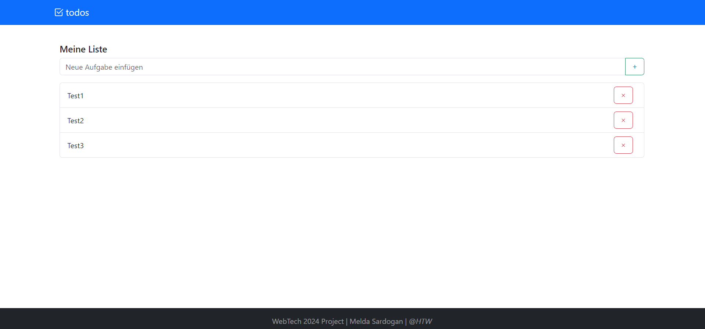

# todos
Die todos-App ist eine einfache, aber leistungsfähige Anwendung zur Verwaltung von Aufgaben. Sie wurde entwickelt, um ein intuitives und schnelles Hinzufügen, Anzeigen und Löschen von Aufgaben direkt vom Dashboard aus zu ermöglichen.

## Features

- **Aufgabenliste**: Alle Aufgaben werden übersichtlich auf dem Dashboard angezeigt.
- **Aufgabe hinzufügen**: Über ein Eingabefeld können neue Aufgaben zur Liste hinzugefügt werden.
- **Aufgabe löschen**: Neben jeder Aufgabe befindet sich ein X-Symbol, mit dem sie aus der Liste entfernt werden kann.



## Installation

Die todos-App ist in zwei Hauptteile unterteilt: das Frontend, entwickelt mit Angular, und das Backend, entwickelt mit Node.js. Um die Anwendung lokal zu starten, folgen Sie bitte den untenstehenden Anweisungen.

### Voraussetzungen

- Node.js (empfohlene Version: [v18.18.0])
- npm (wird mit Node.js installiert)
- Angular CLI (`npm install -g @angular/cli`) [version 17.3.1.]

### Frontend starten

1. Klone das Frontend-Repository:

```bash
git clone `https://github.com/MeldaSardogan/todos-frontend.git`
```

2. Installiere die Dependencies mit npm:

```bash
npm install
```

3. Starte die Entwicklungsumgebung:

```bash
ng serve
```

Nachdem `ng serve` erfolgreich ausgeführt wurde, ist das Frontend auf `http://localhost:4200/` erreichbar.

### Backend starten

1. Klone das Backend-Repository:

```bash
git clone `https://github.com/MeldaSardogan/todos-backend.git`
```

2. Installiere die Dependencies mit npm:

```bash
npm install
```

3. Starte das Backend mit:

```bash
npm run watch
```

Das Backend läuft nun und wartet auf Anfragen von Ihrem Frontend.

## Mitwirkende

- [Melda Sardogan] - Initialer Entwickler
